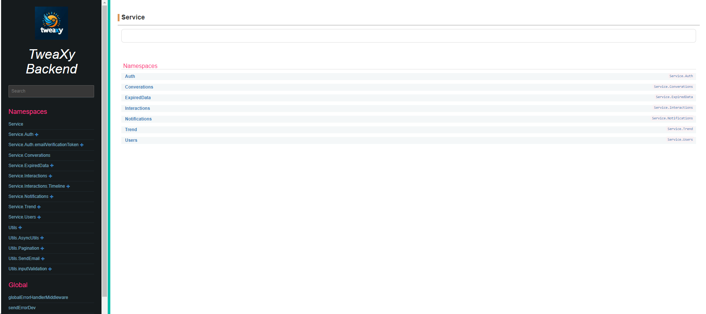
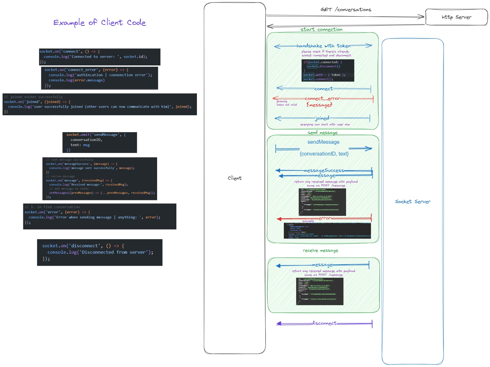

# TweaXy Backend

this backend repo

## License

> This software is licensed under MIT License, See License for more information.

# Features

### Authentication & Registration

-   Login
-   Register new user with captcha
-   send/resend email verification
-   verify email
-   Update username
-   forget/reforget Password
-   reset password using UUID
-   Get user basic profile data using ID
-   Google sign in
    -   [**integrated with FR** | **integrated with CR]\*\*

### Users Profile

-   Search for matching users using their username or screen name (or part of them)
-   Search on tweet of specific users [for CR]
-   Delete/Add a profile banner (restores the default one)
-   Update a profile picture given the new picture.
-   Delete a profile picture (restores the default one)
-   Get/Update the profile of a specific user.
    eg:
    -   username
    -   name
    -   bio
    -   birthday
    -   etc..

### User Interactions

-   Get a list of users that follow the username.
-   Get a list of users that are followed by the username.
-   Follow a certain user using their username.
-   Unfollow a certain user using their username.
-   add/delete get blocks
-   Un/Mute a certain user using his username.\*
-   Get a list of muted users.

### Tweets

-   Add tweets
-   Delete interactions (tweet | retweet | comment)
-   Add, remove likes on tweets
-   Get list of likers
-   Add, Delete, Get tweets
-   Get replies of a certain tweet
-   Add, Delete retweet
-   Add, remove likes on tweets
-   Get list of retweeters
-   Get list of likers
-   Search tweets / or part of the tweet (**Relevance suggestions**)

### Timeline & Trends

-   Get a list of tweets in the home page of the user. (Timeline) (ranked by likes, comments, retweets)
-   Get a list of tweets in the profile of a user
    -   & search on them
-   Get list of retweets in the profile of a user
-   Get tweets that the user mentioned in it
-   Get tweets liked by the user
-   Get a list of tweets that matches (either fully or partially) the sent string. **relevance suggestions **
-   Get a list of available trends
-   Get a list of tweets in a given trend.
-   Search hashtags

### Media

-   Add, get media

### Direct Messages

**\_** unit test done only on REST api endpoints **\_**

-   get conversations of user
-   get messages of conversation
-   add new message
-   get number of unseen conversation (with unseen messages count)
-   utilizing handshake authentication with socket connection

### Notification

-   Get notifications list
-   Get notifications unseen count
-   push notification using firebase service ⇒ when:
    -   user follow me
    -   user liked on any of my interactions
    -   user commented on any of my interactions
    -   user retweeted on any of my interactions
    -   user get mentioned

### Extra requested

-   check email verification using email & token
-   check reset token using email & token
-   check email uniqueness
-   check username uniqueness
-   generate username unique at first step
-   check UUID exists _UUID is user identifier {email, username, password}_

### Extra for testing _should be removed after development done_

-   get users in database API to ease testing

# Development Features

### For Server Maintenance

-   sending emails to team members when unhandled rejection throw on server _to fast took on problem_

### For DB Maintenance

-   seed populated whenever we need to reset db
-   add prisma middleware to not delete any soft deleted models unless done explicitly
-   add cron script run @12:00 am every day to see if any expired data (after 90 days) to delete **doing unit test**

### For Repository Maintenance

-   adding MIT licence to repo
-   experiment first pre-commit _on experimental branch_

### For Code Maintenance

🤓 we tried our best to refactor any duplicated code or function .when we review code and see duplicated code → we issue a task/ticket/github_issue about it

-   Formatting & Lintting in general
    -   run formatter on all files
    -   add lint & format terminal commands to package.json
    -   😨 pre-commit should stop run linnter before commit
-   refactor & review unit testing
    -   add describe and separate files
-   Refactor Functional Documentation
    -   add namespace throughout whole code to easy navigate functional documentation
    -   refactor & reviewed functional documentation through all utils & service
    -   add cool theme to jsdoc functional documentation
        

## 🤓 Coverage Report

we achieved 92**% of code covered**


## Swagger Documentation


## Socket kind of Documentation



# Folder structure

```markdown
📁 backend/
├─📄 Tweaxy ERD
├─📄 .env
├─📄 .eslintrc.cjs
├─📄 .gitignore
├─📄 .prettierrc
├─📄 commit_template.txt
├─📄 jsdoc.json
├─📄 package-lock.json
├─📄 package.json
├─📁 docs/
│ ├─📁 api/
│ └─📁 function/
│ ├─📄 index.html
├─📁 images/
├─📁 prisma/
│ ├─📁 migrations/
│ │ ├─📁 20231019013117_test/
│ │ │ └─📄 migration.sql
│ │ └─📄 migration_lock.toml
│ ├─📄 schema.prisma
│ └─📄 seed.js
├─📄 README.md
├─📁 src/
│ ├─📄 app.js
│ ├─📄 index.js
│ ├─📄 server.js
│ ├─📁 config/
│ │ └─📄 swaggerConfig.js
│ ├─📁 controllers/
│ │ └─📄 userController.js
│ ├─📁 errors/
│ │ ├─📄 appError.js
│ │ ├─📄 globalErrorHandlerMiddleware.js
│ │ ├─📄 handleUncaughtException.js
│ │ ├─📄 handleUnhandeledRejection.js
│ │ ├─📄 sendErrorDev.js
│ │ ├─📄 sendErrorProd.js
│ │ └─📄 sendOperationalErrorProd.js
│ ├─📁 middlewares/
│ │ └─📄 validateMiddleware.js
│ ├─📄 prisma.js
│ ├─📁 routes/
│ │ └─📄 userRoutes.js
│ ├─📁 services/
│ │ └─📄 userService.js
│ ├─📁 test/
│ ├─📁 utils/
│ │ └─📄 catchAsync.js
│ └─📁 validations/
│ └─📄 testSchema.js
```

---

# 11. Design patterns

### 1. Singleton

-   to ensure that we have only one instance of a particular class throughout the application.

### 2. **MVC**

-   separates an application into three interconnected components: the model, the view, and the controller.
-   **Model :** determines how a database is structured
-   **View:** where end users interact within the application.
-   **Controller**:  interacts with the model and serves the response and functionality to the view.

### 3. **Module pattern**

-   allows you to organize your code into separate files or modules

### 4. Middleware

-   used for authentication/authorization of requests , validating incoming parameters and data and for logging requests.
